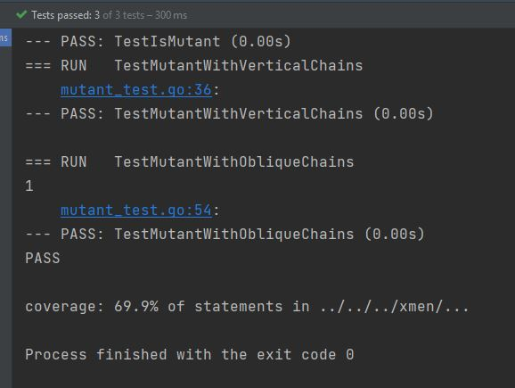
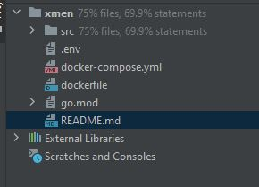

# Examen Mercadolibre

Magneto necesita buscar Mutantes, esta herramienta desarrollada en GO y desplegada con docker en AWS, te ayudara!  


## Consulta si eres mutante!

El ejercicio quedo resuelto y desplegado a traves de AWS. Por lo que si estas leyendo esto, puedes interactuar con este.
Este servicio se encuentra respondiendo en la direccion http://35.171.169.217, por el puerto: 8080.

### El servicio cuenta con dos recursos expuestos:

- Solo debes contar con un generador de solicitudes HTTP como postman, o tu navegador para las peticiones GET. O tambien con CURL.
- A continuacion dejo los CURLs de cada recurso para que puedan ser importados.

- Si quieres consultar si el Adn de un Humano, pertenece a un mutante: 

```
curl --location --request POST 'http://35.171.169.217:8080/mutant' \
--header 'Content-Type: application/json' \
--data-raw '{
"dna": [
"ATGCGA","CAGTGC","TTATGT","AGAAGG","CCCCTA","TCACTG"]
}'
```

- Si quieres consultar las estadisticas de humanos y mutantes verificados.

```
curl --location --request GET 'http://35.171.169.217:8080/stats'
```

## Instrucciones de ejecucion

#### Si quieres ejecutar esto en tu maquina local, debes seguir los siguientes pasos:

- Tener instalado docker y docker compose en tu computadora.
- Clonar este repositorio en un directorio de tu computadora.
- Una vez clonado, entras al repositorio clonado en local y en tu terminal ejecutas: $ docker-compose up
- Debido a que todo se encuentra dockerizado y la base de datos tambien es un contenedor, este comando le indicara a docker que corra los contenedores descritos en los archivos docker.
- Solo tendras que esperar y ya tendras el servicio disponible en el puerto 8080.

## Consideraciones

- El algoritmo para identificar mutantes, funciona para cualquier matriz de tamaño N.
- Se asumio que el conjunto de Mutantes pertenece a el conjunto de humanos. Por lo tanto todos los mutantes son humanos, pero no todos los humanos son mutantes.

## Tecnologias utilizadas

- Como lenguaje de programacion se utilizo GO y su framework Gin para gestionar el servidor.
- Se utilizo una base de datos MySQL para la persistencia de informacion.
- Se creo un contenedor de docker tanto para la app, como para la base de datos.
- Se desplego en una maquina EC2 de AWS, a traves de docker-compose y el repositorio de github.

### Evidencias de pruebas unitarias y covertura.





